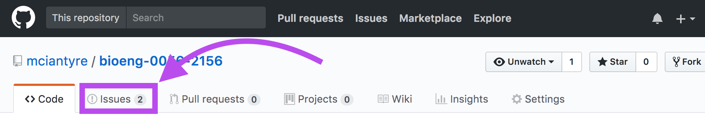

# Contributing

My hope is that this curriculum is developed completely in the open. All stakeholders -- future students, current students, and faculty -- will feel free to propose changes and know why certain decisions were made. Moreover, others should feel free to take and adapt the ideas. As an interface to a version control system, GitHub provides tools that enable open development with history tracking and decision accountability.

## Make suggestions

If you want to make suggestions or talk about course topics, we use the repository issue tracker to track curriculum ideas and discussions.

You'll need a GitHub account to interact with issues. If you want to learn more about the issue tracker, check [this](https://guides.github.com/features/issues/) out.

## Make edits

If you want to make and share edits to the curriculum description, you'll need create a GitHub account and learn about GitHub. To learn the basics of GitHub, read [this tutorial](https://guides.github.com/activities/hello-world/). The tutorial will teach you what you need to contribute to the curriculum.

In order to make modifications, you need to "fork" this repository. Learn about forking [here](https://guides.github.com/activities/forking/). You may then use the skills learned in the first tutorial to edit the README right in the GitHub web interface. Once you've made your edits, open a pull request. We will use the pull request to continue the discussion.

The text is written in Markdown. Learn about Markdown [here](https://github.com/adam-p/markdown-here/wiki/Markdown-Cheatsheet).
